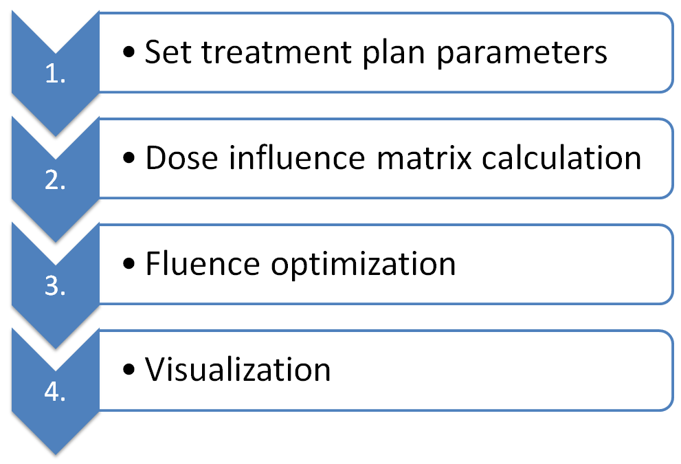

.. |matRad_logo| image:: ../matRad/gfx/matRad_logo.png
   :width: 80 px
   :alt: matRad
   :target: https://www.matRad.org

.. _techdoc:

=======================
Technical Documentation
=======================

|matRad_logo| features a very modular and sequential design which is reflected in the matRad script. 
After importing your own data or loading one of the provided cases, you can start working with matRad dose calculation and optimization modules. 
The four main parts of the matRad workflow are

Information about the individual modules is given in the following subsections:

`Set treatment plan parameters <Set-treatment-plan-parameters>`__

`Dose influence matrix
calculation <Dose-influence-matrix-calculation>`__

`Fluence optimization <Fluence-optimization>`__

`Visualization <Visualization>`__

How to cite matRad
------------------

`matRad publications <How-to-cite-matRad>`__

.. _httpsrawgitcomwikie0404matradimagesmatrad_blanksvg--height--25pxs-most-important-matlab-variables:

|matRad_logo|'s most important Matlab variables
-----------------------------------------------

`pln-struct <pln>`__ Treatment plan information

`ct-struct <ct>`__ CT-data

`cst-cell array <cst>`__ Structure sets, inverse planning objectives, and other meta-information

`stf-struct <stf>`__ Steering information

`dij-struct <dij>`__ Dose influence data

`result-struct <result>`__ Resulting dose distribution, RBE cube etc..

Additional information
----------------------

`How to run matRad with Octave <How-to-run-matRad-with-Octave>`__

`matRad coordinate system <The-matRad-coordinate-system>`__

`The CORT dataset <The-CORT-dataset>`__

`DICOM import <The-dicom-import>`__

`Minimum system requirements <min-sys-requirements>`__
